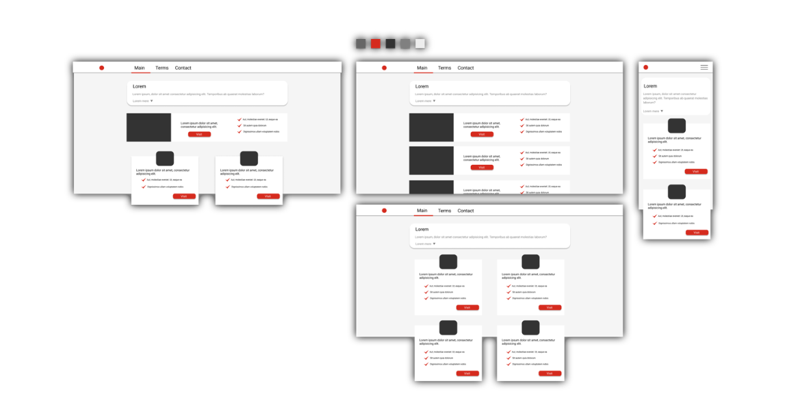
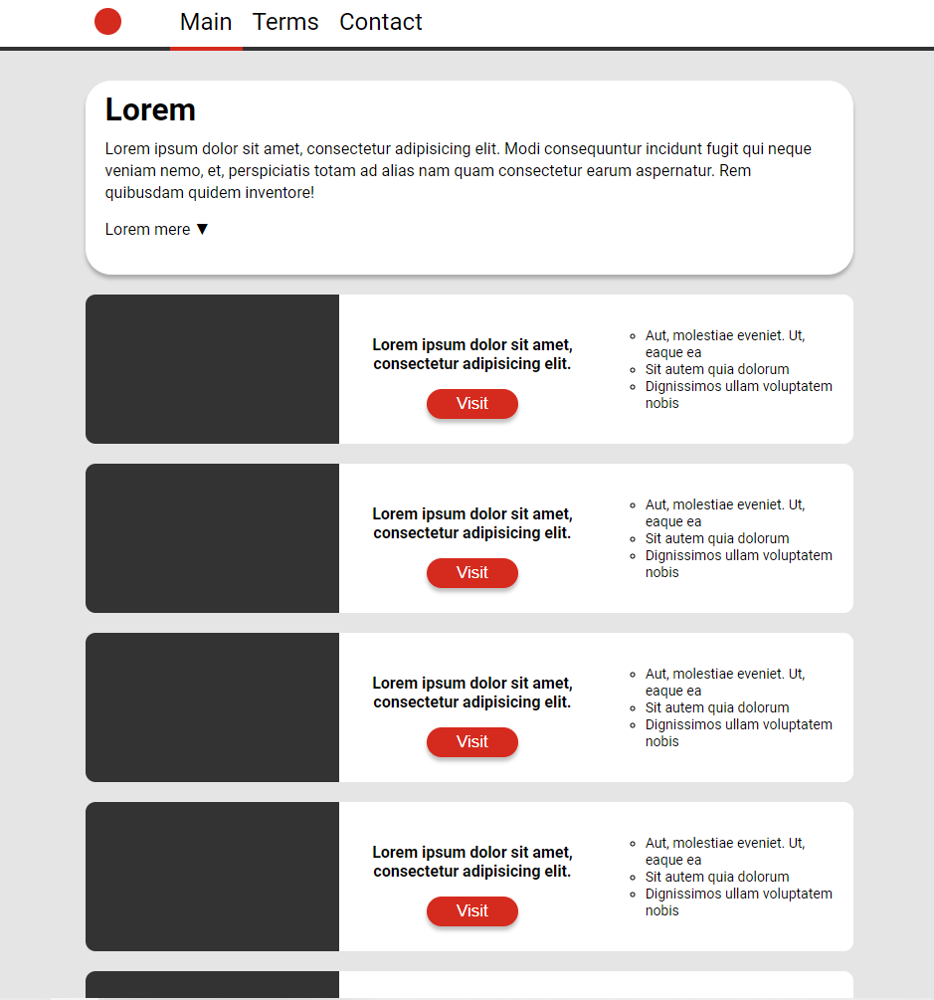
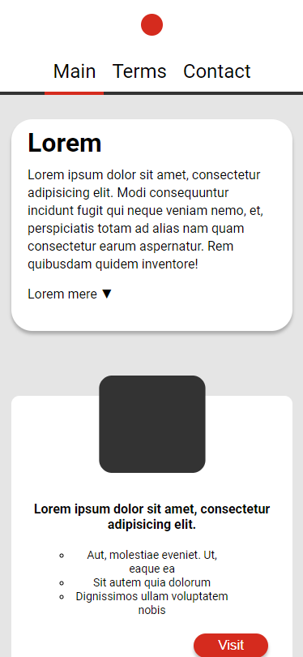

<h1 align="center">
  <a href="https://hamzakhuswan.com/simple-website">
    
     
    Simple Website
  </a>
</h1>

This is a simple website made for school, and it meant to be simple. This website was created using prebuilt webpack template (my private template which I use to create landing pages fast). Of course I could do more complicated one, but this wasn't the point.

# The process

My process of building such simple website is pretty straight forward and this is how it looks like.

1. First thing I have to have I a sketch. I either create it via an app called Figma or someone provides it to me.
2. Secondly when the idea is visulized, I have to think of technologies and approches I have to take to create the website.
3. Then I code I lay the fundation and convert the sketch as good as I can to code.
4. Lastly is tweaks. This part takes most of the time and can last forever. So I have to allocate resonable time for it.

## Sketch

Sketch can be done in many ways, but I prefer one way and it is to use software called [Figma](http://figma.com/). Figma unlike many UI design tools you don't need to pay to make use of it. An advantage of using such tool is that you it design for such thing, and you can visulize your ideas with good accuracy and with ease.

But of course you could use any other tool.

This is what sketched in Figma. Of course this is a sketch and the finle version will look different, as you can see bellow.

## Planing
This part is not like what it looks like. It is not about deciding forhand the names of packages. Instead it is general, abstraction. E.g. think of the important thing, ask yourself good questions, how could I replicate the sketch as good and as efficent as possible?

For example you can decide what framework or langauge should you use, or  maybe you shouldn't you use any at all. In my case there was not need for fancy pacakges in this simple page, I had only development dependency. These dependencies I have compile at the execution time and resualt for code runing in the web browser. 

Planning is for ending up with good result, but it also for your developer happienss. Because believe me no one can write repeated `div`:s or code many 8 times.

## Coding
In this part I lay out the structure for the website. It is good idea to fellow good pratices like dividing files, code spliting and doing component based code. It will make life easier. But if you using a framework like React, you are already doing that.

Try not to go in details here, because you will be tweaking a lot in the next part.

## Tweaking (optional)
This is most time consuming part, and might take forever. So be careful here. It is a loop, and specially if you working with clients. 

This is what the website looked after that third stage. It could definitely be improved. But because this is school project, I might not do any further improvements.

  
  

------
[Hamza Khuswan](https://hamzakhuswan.com) - web developer and  CS (Computer Science) learner.