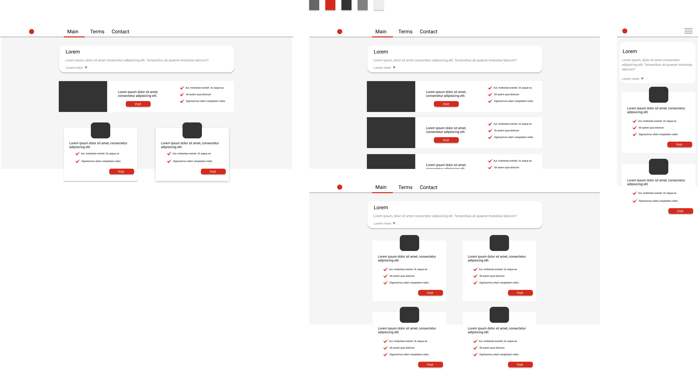

[Simple website](https://github.com/hamzakhuswan/simple-website)

## Sketch
Sketch can be done in many ways, but I prefer one way and it is to use software called Figma. Figma unlike many UI design tools you do not need to pay to make use of it. But of course, you could use any other tool.

This is what sketched in Figma. Of course, this is a sketch, and the final version will look different, as you can see below.

## Planing

This part is not like what it looks like. It is not about deciding forehand the names of packages. Instead, it is general, abstraction. E.g., think of the important thing, ask yourself good questions, how could I replicate the sketch as good and as efficient as possible?

For example, you can decide what framework or language should you use, or maybe you should not use any at all. In my case there was no need for fancy packages in this simple page, I had only development dependencies. These dependencies were necessary for compiling the code at the execution time.

Planning is for ending up with good result, but it also for your developer happiness.

## Coding

In this part I lay out the structure for the website. It is good idea to fellow good practices like dividing files, code splitting and doing component-based code. It will make life easier. But if you are using a framework like React, you are already doing that.

Try not to go in details here, because you will be tweaking a lot in the next part.

## Tweaking (optional)

This is most time-consuming part and might take forever. So be careful here. This especially true when you are working with clients.

This is what the website looked after that third stage. It could definitely be improved. But because this is school project, I might not do any further improvements.